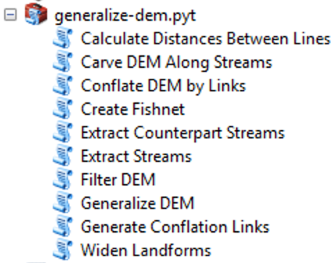

  

# Generalization and conflation of digital elevation models

**generalize-dem** toolbox contains tools for structural generalization and conflation of digital elevation models.

## Requirements

You need **ArcGIS Pro** (Python 3.6) or **ArcGIS for Desktop 10.3+** (Python 2.7) with *Spatial Analyst* and *3D Analyst* extension modules to use the toolbox.

## Installation

Download the latest [release](https://github.com/tsamsonov/generalize-dem/releases) and extract the contents of ZIP archive. You should see `generalize-dem.pyt` Python toolbox in the *Catalog* window pane of **ArcGIS Pro** or **ArcMap**:

## Usage

Ten tools are contained in the toolbox:

1. **Сalculate Distances Between Lines** tool calculates Directed Hausdorff, Hausdorff and Frechét distances between correspoding lines in two feature classes.

2. **Carve DEM along streams** tool changes cell values in DEM so that elevation is monotonoysly decreasing along given lines.

3. **Conflate DEM by Links** tool performes rubbersheeting of DEM so that it becomes spatially adjusted with a given set of reference hydrographic lines.

4. **Create Fishnet** tool generates rectangular grids with overlapping or non-overlapping cells.

5. **Extract Counterpart Streams** tool finds path in drainage network that are similar to given reference hydrographic lines.

6. **Extract Streams** tool traces the streams using flow accumulation and length criteria.

7. **Filter DEM** tool performs filtering of DEM.

8. **Generalize DEM** tool performs structural generalization of raster digital elevation model

9. **Generate Conflation Links** tool generates conflation links between counterpart streams and reference hydrographic lines.

10. **Widen Landforms** tool allows widening of negative and positive terrain features, which can be very effective to improve visual analysis of generalized DEM.

## Example data

You can find an example DEM in `dem.gdb` geodatabase (please unzip gdb before using). Source dem is called simply `dem` and generalized is called `dem_gen`.

## Acknowledgements

[pybind11](https://github.com/pybind/pybind11/) library is used to compile stream extraction module.

## Further reading

A detailed description of the method can be found in the following papers:

*Samsonov T.* Multiscale hypsometric mapping // **Advances in Cartography and GIScience, Vol. 1.** — Lecture Notes in Geoinformation and Cartography. — Springer: Heidelberg, Germany, 2011. — P. 497–520. DOI: [10.1007/978-3-642-19143-5_28](http://dx.doi.org/10.1007/978-3-642-19143-5_28)

*Samsonov T.* Automated Conflation of Digital Elevation Model With Reference Hydrographic Lines. *Under review*

## Citation & Copyright

To cite the software use the following reference:

*Samsonov, T.*, 2020. Generalize DEM: ArcGIS Python toolbox for automated structural generalization and conflation of digital elevation models. **Zenodo**. DOI:[-](-)

© 2010-2020, Timofey Samsonov, Lomonosov MSU Faculty of Geography.